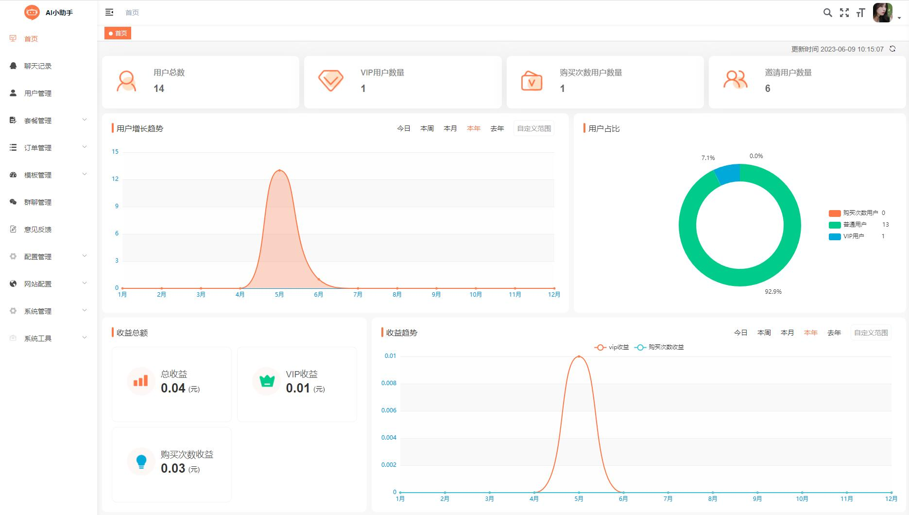

## 项目名称
* AI小助手后台管理系统

```bash
# 克隆项目
git clone https://github.com/tsshop/tsai-backend-web.git

# 进入项目目录
cd tsai-backend-web

# 安装依赖
npm install

# 建议不要直接使用 cnpm 安装依赖，会有各种诡异的 bug。可以通过如下操作解决 npm 下载速度慢的问题
npm install --registry=https://registry.npmmirror.com

# 启动服务
npm run dev
```

浏览器访问 http://localhost:9162

## 发布

```bash
# 构建测试环境
npm run build:stage

# 构建生产环境
npm run build:prod
```
## 技术咨询
* AI开源交流群 856295087 (QQ)

## 效果


